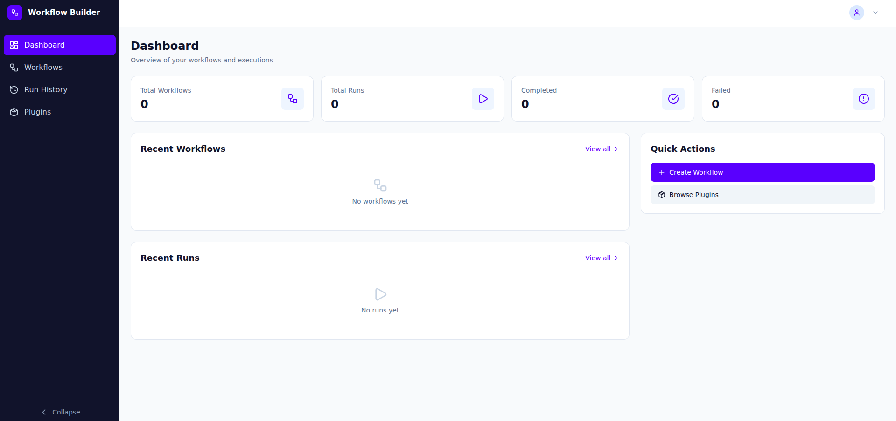
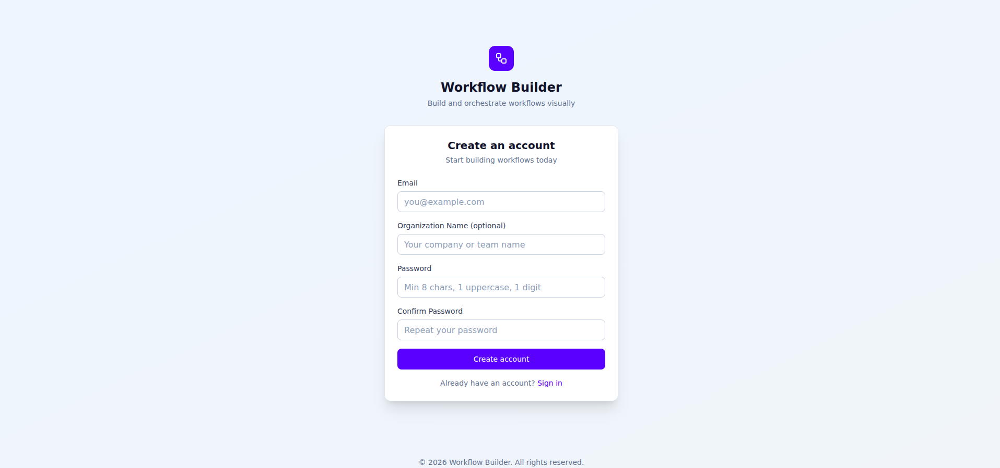
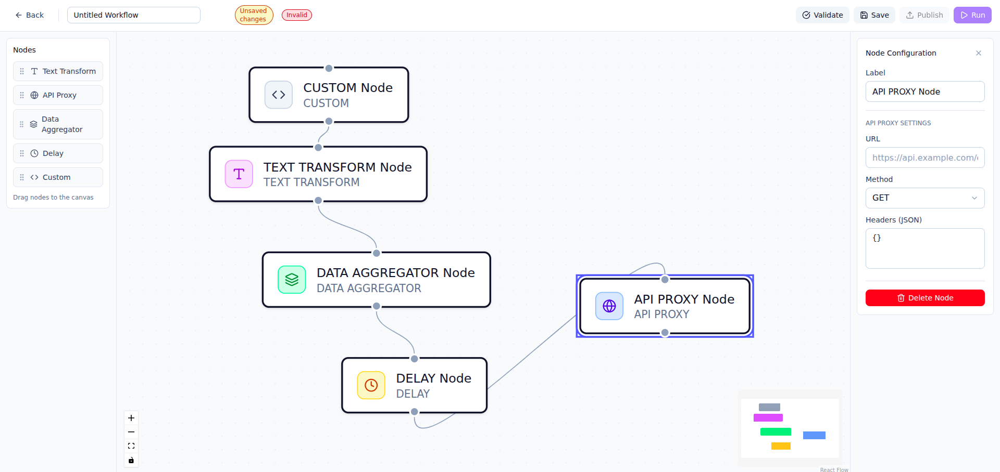

# Distributed Workflow Builder

A visual, distributed workflow automation platform that enables users to design, execute, and monitor complex workflows through a drag-and-drop interface. Built with a microservices architecture for scalability and reliability.



## Table of Contents

- [Features](#features)
- [Architecture](#architecture)
- [Tech Stack](#tech-stack)
- [Getting Started](#getting-started)
- [Usage Guide](#usage-guide)
- [Node Types](#node-types)
- [Workflow Examples](#workflow-examples)
- [API Reference](#api-reference)
- [Project Structure](#project-structure)

---

## Features

- **Visual Workflow Builder**: Drag-and-drop interface for creating workflows
- **Multiple Node Types**: TEXT_TRANSFORM, API_PROXY, DATA_AGGREGATOR, DELAY, CUSTOM
- **Real-time Execution Monitoring**: WebSocket-based live updates
- **Multi-tenant Architecture**: Isolated workspaces per tenant
- **Plugin System**: Extensible with custom plugins
- **DAG Validation**: Ensures workflows are valid directed acyclic graphs
- **Retry Policies**: Configurable retry strategies per node
- **Audit Logging**: Complete audit trail of all actions

---

## Architecture

```
┌─────────────────────────────────────────────────────────────────────────────┐
│                              FRONTEND (React)                                │
│                         http://localhost:3000                                │
└─────────────────────────────────────────────────────────────────────────────┘
                                      │
                                      ▼
┌─────────────────────────────────────────────────────────────────────────────┐
│                           API GATEWAY (:8000)                                │
│              Rate Limiting │ JWT Validation │ Request Routing                │
└─────────────────────────────────────────────────────────────────────────────┘
          │              │              │              │              │
          ▼              ▼              ▼              ▼              ▼
    ┌──────────┐  ┌──────────┐  ┌──────────┐  ┌──────────┐  ┌──────────┐
    │   AUTH   │  │ WORKFLOW │  │ORCHESTRAT│  │  PLUGIN  │  │WS-GATEWAY│
    │  :3001   │  │  :3002   │  │   :3003  │  │  :3004   │  │  :3005   │
    └──────────┘  └──────────┘  └──────────┘  └──────────┘  └──────────┘
          │              │              │              │              │
          └──────────────┴──────────────┴──────────────┴──────────────┘
                                      │
          ┌───────────────────────────┼───────────────────────────┐
          ▼                           ▼                           ▼
    ┌──────────┐              ┌──────────┐                ┌──────────┐
    │POSTGRESQL│              │  REDIS   │                │  MINIO   │
    │  :5432   │              │  :6379   │                │  :9000   │
    └──────────┘              └──────────┘                └──────────┘
                                      │
                                      ▼
                              ┌──────────────┐
                              │    WORKER    │
                              │   (BullMQ)   │
                              └──────────────┘
```

### Service Responsibilities

| Service | Port | Description |
|---------|------|-------------|
| **Gateway** | 8000 | API gateway with rate limiting, JWT validation, and request routing |
| **Auth** | 3001 | User authentication, JWT token management, session handling |
| **Workflow** | 3002 | Workflow CRUD operations, version management |
| **Orchestrator** | 3003 | Workflow execution, run management, step coordination |
| **Plugin** | 3004 | Plugin marketplace, plugin CRUD, artifact storage |
| **WS-Gateway** | 3005 | WebSocket server for real-time updates |
| **Worker** | - | Background job processing using BullMQ |

### Data Flow

1. **User creates workflow** → Frontend → Gateway → Workflow Service → PostgreSQL
2. **User executes workflow** → Gateway → Orchestrator → Redis Queue → Worker
3. **Worker processes steps** → Worker → Plugin execution → Results to PostgreSQL
4. **Real-time updates** → Worker → Redis Pub/Sub → WS-Gateway → Frontend

---

## Tech Stack

### Frontend
- **React 18** with TypeScript
- **ReactFlow** for visual workflow canvas
- **Zustand** for state management
- **TailwindCSS** for styling
- **Socket.io Client** for real-time updates

### Backend
- **Node.js 20** with TypeScript
- **Express.js** for REST APIs
- **BullMQ** for job queue management
- **Socket.io** for WebSocket communication
- **PostgreSQL 16** for persistent storage
- **Redis 7** for caching and pub/sub
- **MinIO** for object storage (plugin artifacts)

### Infrastructure
- **Docker** &amp; **Docker Compose** for containerization
- **npm workspaces** for monorepo management

---

## Getting Started

### Prerequisites

- Node.js >= 20.0.0
- npm >= 10.0.0
- Docker &amp; Docker Compose
- Git

### Installation

1. **Clone the repository**
```bash
git clone https://github.com/your-org/distributed-workflow-builder.git
cd distributed-workflow-builder
```

2. **Install dependencies**
```bash
npm install
```

3. **Start the infrastructure (all services)**
```bash
cd infra
docker compose up -d
```

4. **Wait for services to be healthy**
```bash
docker compose ps
```

All services should show "healthy" status.

5. **Start the frontend (development mode)**
```bash
cd frontend
npm run dev
```

6. **Access the application**
- Frontend: http://localhost:3000
- API Gateway: http://localhost:8000
- MinIO Console: http://localhost:9001

### Default Credentials

```
Email: admin@example.com
Password: Admin@123
```



---

## Usage Guide

### Creating a New Workflow

1. **Login** to the application
2. Navigate to **Workflows** page
3. Click **"New Workflow"** button
4. You'll see the visual workflow builder



### Building a Workflow

1. **Drag nodes** from the left palette onto the canvas
2. **Connect nodes** by dragging from output handle to input handle
3. **Configure nodes** using the right panel when a node is selected
4. **Save** the workflow using the toolbar

### Node Configuration

Each node type has specific configuration options:

#### Text Transform Node
```json
{
  "operation": "uppercase",  // uppercase, lowercase, reverse, caesar, sha256
  "text": "input text",      // or use previous step output
  "shift": 3                 // only for caesar cipher
}
```

#### API Proxy Node
```json
{
  "url": "https://api.example.com/endpoint",
  "method": "GET",           // GET, POST, PUT, PATCH, DELETE
  "headers": {
    "Authorization": "Bearer token"
  },
  "body": {}                 // for POST/PUT/PATCH requests
}
```

#### Data Aggregator Node
```json
{
  "operation": "merge",      // merge, concat, sum
  "inputs": []               // automatically populated from connected nodes
}
```

#### Delay Node
```json
{
  "delayMs": 1000           // delay in milliseconds (100-60000)
}
```

#### Custom Node
```json
{
  "code": "// Your JavaScript code here\nreturn input.toUpperCase();"
}
```

### Executing a Workflow

1. Open a saved workflow
2. Click **"Run"** in the toolbar
3. Optionally provide input data
4. Monitor execution in real-time on the **Execution** page

---

## Node Types

### 1. TEXT_TRANSFORM
Transforms text using various operations.

| Operation | Description |
|-----------|-------------|
| uppercase | Convert to UPPERCASE |
| lowercase | Convert to lowercase |
| reverse | Reverse the string |
| caesar | Caesar cipher encryption |
| sha256 | SHA-256 hash |

### 2. API_PROXY
Makes HTTP requests to external APIs.

- Supports GET, POST, PUT, PATCH, DELETE
- Custom headers
- Request body for POST/PUT/PATCH
- Automatically parses JSON responses

### 3. DATA_AGGREGATOR
Combines data from multiple input nodes.

| Operation | Description |
|-----------|-------------|
| merge | Deep merge objects |
| concat | Concatenate arrays/strings |
| sum | Sum numeric values |

### 4. DELAY
Introduces a delay in workflow execution.

- Useful for rate limiting
- Range: 100ms to 60,000ms

### 5. CUSTOM
Execute custom JavaScript code.

- Access input via `input` variable
- Return value becomes step output
- Sandboxed execution environment

---

## Workflow Examples

### Example 1: Text Processing Pipeline

```
[Input Text] → [Uppercase] → [SHA-256 Hash] → [Output]
```

**Configuration:**
1. Add **TEXT_TRANSFORM** node (operation: uppercase)
2. Add **TEXT_TRANSFORM** node (operation: sha256)
3. Connect: Input → Uppercase → SHA256

### Example 2: API Data Fetch with Transform

```
[API Proxy] → [Data Aggregator] → [Text Transform] → [Output]
     ↓              ↑
[API Proxy] ────────┘
```

**Use Case:** Fetch data from two APIs, merge results, transform output.

### Example 3: Scheduled API Call with Retry

```
[Delay 5s] → [API Proxy] → [Output]
                 ↺
            (retry 3x)
```

**Configuration:**
1. Add **DELAY** node (delayMs: 5000)
2. Add **API_PROXY** node with retry policy:
   - maxAttempts: 3
   - initialDelayMs: 1000
   - backoffMultiplier: 2

### Example 4: Conditional Workflow

```
                    ┌─[condition: true]─→ [Process A]
[API Check] ────────┤
                    └─[condition: false]─→ [Process B]
```

**Edge Conditions:**
- Click on edge to configure
- Add condition expression: `output.status === 'success'`

---

## API Reference

### Authentication

#### POST /api/auth/login
```json
{
  "email": "user@example.com",
  "password": "password123"
}
```

#### POST /api/auth/register
```json
{
  "email": "newuser@example.com",
  "password": "password123",
  "tenantName": "My Organization"
}
```

### Workflows

#### GET /api/workflows
List all workflows for current tenant.

#### POST /api/workflows
```json
{
  "name": "My Workflow",
  "description": "Description here",
  "definition": {
    "nodes": [...],
    "edges": [...]
  }
}
```

#### GET /api/workflows/:id
Get workflow details with latest version.

#### PUT /api/workflows/:id
Update workflow.

#### DELETE /api/workflows/:id
Delete workflow.

### Runs

#### POST /api/runs
```json
{
  "workflowId": "uuid",
  "input": { "key": "value" }
}
```

#### GET /api/runs/:id
Get run details with step statuses.

#### GET /api/runs/:id/logs
Get execution logs for a run.

---

## Project Structure

```
distributed-workflow-builder/
├── frontend/                    # React frontend application
│   ├── src/
│   │   ├── api/                # API client functions
│   │   ├── components/         # React components
│   │   │   ├── builder/        # Workflow builder components
│   │   │   ├── dashboard/      # Dashboard components
│   │   │   ├── execution/      # Execution monitoring
│   │   │   └── ui/             # Reusable UI components
│   │   ├── hooks/              # Custom React hooks
│   │   ├── lib/                # Utilities and constants
│   │   ├── pages/              # Page components
│   │   ├── stores/             # Zustand stores
│   │   └── types/              # TypeScript types
│   └── package.json
│
├── services/                    # Backend microservices
│   ├── auth/                   # Authentication service
│   ├── gateway/                # API gateway
│   ├── orchestrator/           # Workflow orchestration
│   ├── plugin/                 # Plugin management
│   ├── worker/                 # Background job processor
│   ├── workflow/               # Workflow CRUD
│   └── ws-gateway/             # WebSocket server
│
├── packages/                    # Shared packages
│   ├── dag-engine/             # DAG validation engine
│   └── shared-types/           # Shared TypeScript types
│
├── infra/                       # Infrastructure configs
│   ├── docker-compose.yml      # Main Docker compose file
│   └── docker-compose.test.yml # Test configuration
│
├── assest-readme/              # README assets/screenshots
├── init.sql                    # Database schema
├── package.json                # Root package.json
└── tsconfig.json               # Root TypeScript config
```

---

## Environment Variables

Create a `.env` file in the `infra/` directory:

```env
# Database
POSTGRES_USER=wfb
POSTGRES_PASSWORD=wfbsecret
POSTGRES_DB=wfb

# JWT
JWT_SECRET=your-super-secret-jwt-key

# MinIO
MINIO_ROOT_USER=minioadmin
MINIO_ROOT_PASSWORD=minioadmin123
```

---

## Development

### Running Individual Services

```bash
# Start infrastructure only
cd infra && docker compose up -d postgres redis minio

# Run auth service
cd services/auth && npm run dev

# Run frontend
cd frontend && npm run dev
```

### Building for Production

```bash
# Build all services
npm run build

# Build Docker images
cd infra && docker compose build
```

### Running Tests

```bash
# Run all tests
npm test

# Run integration tests
npm run test:integration
```

---

## Troubleshooting

### Services not connecting

If using **snap Docker**, bridge networking may not work. The docker-compose.yml is configured to use `network_mode: host` to work around this issue.

### Port conflicts

Default ports used:
- 5432: PostgreSQL
- 6379: Redis
- 8000: API Gateway
- 9000/9001: MinIO
- 3001-3005: Backend services
- 3000: Frontend (dev server)

Ensure these ports are available before starting.

### Database initialization fails

The `init.sql` runs automatically on first PostgreSQL start. To re-initialize:

```bash
cd infra
docker compose down -v  # Remove volumes
docker compose up -d
```

---

## Contributing

1. Fork the repository
2. Create a feature branch
3. Make your changes
4. Run tests
5. Submit a pull request

---

## License

MIT License - see [LICENSE](LICENSE) for details.
